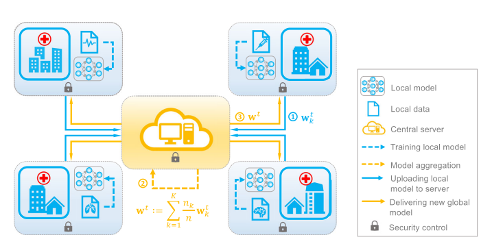

# Aprendizaje Federado CDMX
El **Aprendizaje Federado (FL)** es un enfoque de aprendizaje automático donde los modelos son entrenados en dispositivos distribuidos, sin que los datos de entrenamiento abandonen los dispositivos locales. Esta configuración permite la colaboración entre múltiples dispositivos o instituciones sin compartir datos sensibles. Este modelo fue introducido por Google en 2016 [@yang2019federated] y funciona en esencia en una estructura como en la Figura \ref{ArqFedLE}. 

En esta configuración, un servidor central inicializa los parámetros de un modelo que se quiere ajustar, luego cada cliente (aquellas personas o instituciones que cuentan con una base de datos) actualiza de manera local sus parámetros (parámetros locales) y devuelve estos al servidor central (sólo los parámetros, nunca los datos). Luego, este, habiendo recibido actualizaciones de todos los clientes, actualiza los parámetros de manera general (parámetros globales), y el ciclo se repite de nuevo hasta alcanzar una cantidad predeterminada de iteraciones. Esta configuración permite que las bases de datos que posea cada cliente nunca salgan de ellos, evitando así compartir información sensible. Esta idea queda planteada en el Algoritmo \ref{EsqGenFL}, en este la función `$ClientUpdate(k, w_t)$` representa la forma en que el cliente `$k$` actualizará sus parámetros a partir de los actuales. Más adelante se abordarán las posibles opciones.



### Algoritmo: Esquema General FL

```algorithm
\caption{Esquema General FL} \label{EsqGenFL}
\begin{algorithmic}[1]
\State \textbf{Resultado:} Modelo global entrenado
\State \textbf{Inicializar:} $w_0$
\For{cada ronda global $t = 0, 1, \dots$}
    \For{cada cliente $k \in \{1, \dots, K\}$}
        \State $w_{t+1}^k \gets \text{ClientUpdate}(k, w_t)$
    \EndFor
    \State $w_{t+1} \gets \frac{1}{n} \sum_{k=1}^{K} n_k w_{t+1}^k$
\EndFor
\end{algorithmic}
\end{algorithm} 
```


El Aprendizaje Federado presenta una serie de ventajas:

- **Privacidad**: Los datos permanecen en los dispositivos locales.
- **Reducción de Ancho de Banda**: Solo se transfieren parámetros del modelo, no datos.
- **Creación de muestras grandes**: Cuando de manera local no se tienen suficientes datos para entrenar un modelo, se puede hacer en conjunto con otros clientes.

En contraste, también presenta desventajas o debilidades como:

- **Conflictos de comunicación**: Requiere múltiples rondas de comunicación y, por lo tanto, más cooperación por parte de los clientes.
- **Seguridad**: Riesgos de ataques como *model poisoning* (envenenamiento de parámetros) [@zhou2021deep].

Aún con esto, resulta ser una alternativa viable para ciertas tareas de aprendizaje como:

- **Salud**: Colaboración entre hospitales para mejorar diagnósticos sin compartir datos de pacientes.
- **Tecnología Móvil**: Personalización de modelos en dispositivos móviles (por ejemplo, teclados predictivos, sugerencias de contenido, etc.).

Pese a las ventajas y las múltiples aplicaciones que puede tener el FL, el hecho de tener un constante intercambio de parámetros lo hace vulnerable a que un adversario malicioso que tenga acceso a este intercambio de información pueda aprender algo sobre los datos de entrenamiento. Por esto, en los tres enfoques que seguiremos, se usará la DP para perturbar las actualizaciones de parámetros y comparar la efectividad de este entrenamiento.


## Enfoque por Descenso del Gradiente Estocástico

El Descenso por Gradiente Estocástico es una variante del método por descenso del gradiente, el cual es un método para optimizar una función.

La idea clave del descenso de gradiente estocástico es que el gradiente es un promedio, y podemos estimar ese promedio usando un pequeño subconjunto de muestras [@goodfellow2016deep]. En cada paso del algoritmo, seleccionamos un lote de muestras \( \{x_{1}, \ldots, x_{B}\} \) al azar del conjunto de entrenamiento. El tamaño del lote suele ser pequeño, normalmente entre 1 y unos pocos cientos de muestras. Lo importante es que el tamaño se mantiene constante, incluso si el conjunto de entrenamiento es muy grande. De este modo, podemos entrenar modelos con miles de millones de muestras utilizando actualizaciones basadas en solo unas pocas muestras a la vez.

El gradiente estimado se calcula como:

\[
g = \frac{1}{B} \sum_{i=1}^{B} \nabla L(w, x_i).
\]

usando las muestras del lote. Luego, el algoritmo de descenso de gradiente estocástico ajusta los parámetros siguiendo este gradiente:

\[
w \leftarrow w - \eta g,
\]

donde \( \eta \) es la tasa de aprendizaje.


